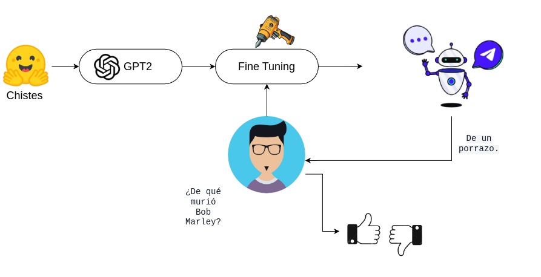
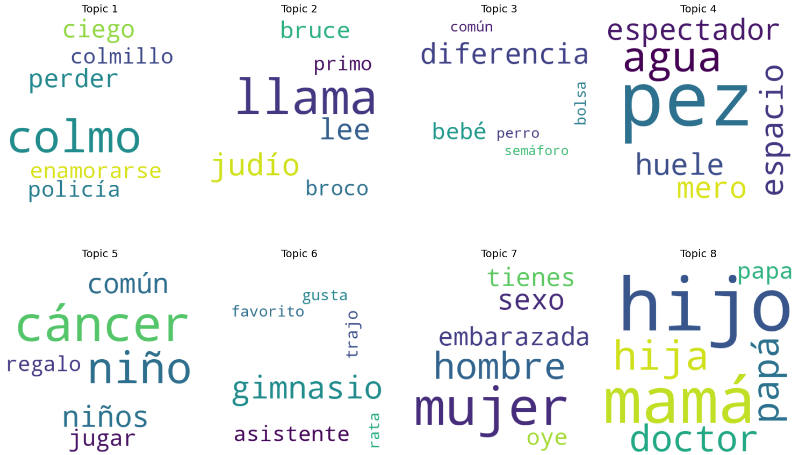
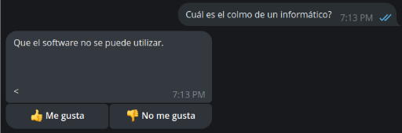

# Explorando las capacidades de GPT-2 para generar comentarios humorísticos

Autores: [Kevin Mansilla](https://github.com/kevmansilla), 
[Lopez Leandro](https://github.com/LeandroLopez013).

## Introducción
En este proyecto exploraremos las capacidades de GPT-2 para generar comentarios 
humorísticos en español. Para ello utilizaremos la técnica de *fine-tuning*, que 
consiste en entrenar el modelo con un dataset específico para que pueda generar 
texto con un estilo particular. 

Los resultados obtenidos durante el entrenamiento no fueron los esperados, 
por lo que concluimos que GPT-2 no está preparado para entender un concepto tan 
abstracto o subjetivo como lo es el humor.

En las siguientes secciones se detallarán el modelo utilizado, la base de 
datos desarrollada, la metodología empleada y los parámetros seleccionados para el 
entrenamiento. Posteriormente, se analizarán los resultados obtenidos, 
se presentarán conclusiones específicas y se plantearán posibles líneas de 
trabajo futuro. Finalmente, se incluirá un anexo que describe las 
dificultades enfrentadas durante el desarrollo del proyecto.
## Modelo

El modelo utilizado es [GPT2-medium](https://huggingface.co/DeepESP/gpt2-spanish-medium) 
que es un modelo de generación de lenguaje entrenado desde cero con 11,5GB de 
textos en español, de los cuales 3.5GB corresponden a artículos de Wikipedia y 
8GB a libros de narrativa, cuentos, poesías, ensayos y divulgación. Los datos 
usan tokenizador Byte Pair Encoding (BPE), los parámetros utilizados son los 
mismos que los de la versión mediana del modelo OpenAI GPT-2 original.

En la siguiente imagen se presenta la arquitectura del modelo, que consiste en 
cargar la base de datos de *hugginface*, luego el modelo base que describimos 
anteriormente, para posteriormente realizar el fine-tunning. Una vez realizado 
esto el usuario puede ingresar una pregunta como por ejemplo "¿De qué murió Bob
Marley?", y el modelo fine tuneado le devolverá por medio de un bot de telegram 
una respuesta graciosa como puede ser "De un porrazo", la cual podrá ser 
evaluada con un like o dislike.

<figure>
    
</figure>

En las siguientes secciones se darán detalles más profundos de cada parte de la
arquitectura.

## Base de datos

Dada la gran variedad de estructuras de chistes que existen, decidimos limitar 
nuestro experimento a solo chistes del tipo pregunta y respuesta, como por 
ejemplo:

```
P: ¿De qué murió Bob Marley?
R: De un porrazo.
```
Como no encontramos datos en español con este formato, decidimos construir nuestra
propia base de datos, usando una combinación de las disponibles en *Huggingface* 
y aplicando un filtro para quedarnos solo con los chistes de la estructura 
correcta ([1](https://huggingface.co/datasets/ysharma/short_jokes),
[2](https://huggingface.co/datasets/xaviviro/chistes_eugenio),
[3](https://huggingface.co/datasets/Danielbrdz/Barcenas-HumorNegro),
[4](https://huggingface.co/datasets/mrm8488/CHISTES_spanish_jokes)). 

Al combinar estos *datasets* obtuvimos de unos 700 chistes, lo que nos pareció 
poco, por lo que decidimos hacer un *web scraping* de algunas páginas aleatorias, 
con lo que logramos un total de 1.732 chistes. 

A su vez, a cada elemento de la [base de datos](https://huggingface.co/datasets/kevmansilla/jokes_spanish_tm) 
decidimos agregarles unos *tags* que ayuden al modelo a entender la estructura 
del chiste y poder generar respuestas más acertadas. Como, por ejemplo:
```
<START>[QUESTION] ¿De qué murió Bob Marley? [ANSWER] De un porrazo. <END>
```
Donde `<START>` y `<END>` son los *tokens* de inicio y fin de texto, `[QUESTION]` 
y `[ANSWER]` son los *tags* que indican el tipo de texto que sigue. Estos 
serán de gran ayuda al momento de entrenar el modelo y generar respuestas acordes.

Por otra parte, también realizamos un *topic modelling* el cual se puede 
consultar en el archivo `lda_new_dataset.ipynb` para ver cómo se distribuyen
los chistes en distintos tópicos. Los resultados se pueden ver en la siguiente
imagen, se observa a simple vista que analizando 8 tópicos con 6 palabras 
claves en cada uno, no se logra encontrar una relación clara entre los chistes
de cada tópico, solo en algunos como el tópico 8 donde habla de hijo, hija, mamá, 
papá, y el tópico 7 pero en menor medida.

<figure>
    
</figure>


### Metodología y entrenamiento

Para poder entrenar el modelo utilizaremos librerías de python como `keras`,
`torch` y `transformers`, debido a que son las más utilizadas por la comunidad 
y presentan una gran cantidad de recursos y documentación. Y empleando
[este](https://huggingface.co/crscardellino/flisol-cba-martin-fierro/blob/main/flisol-cordoba-2023.ipynb) 
repo como guía para el *finetuning*

Antes de iniciar el entrenamiento, separamos la base de datos en un set de 
entrenamiento y otro de validación, con un 70% y 30% respectivamente. Luego, 
tokenizamos los textos y los convertimos en tensores para poder alimentar al modelo.

Para entrenar de manera más eficiente usamos lo que se conoce como 
**batch gradiend decent**. Donde la idea es tomar los textos de a bloques 
de un valor má  ximo para calcular el gradiente. Esta técnica ofrece un balance
entre el cálculo exacto de gradientes (descenso de gradiente en 
batch completo) y la eficiencia de procesamiento (descenso de 
gradiente estocástico).

Nosotros usamos un tamaño de *batch* de 8, es decir, que tomamos 8 chistes a la
vez para calcular el gradiente y actualizar los pesos del modelo. Esto nos 
pareció adecuado, ya que no contamos con una gran cantidad de datos y 
queríamos utilizar los recursos computacionales de manera eficiente.

Los parámetros utilizados para el entrenamiento fueron los siguientes:
``` overwrite_output_dir=True,
    num_train_epochs=12,
    learning_rate=1e-6,
    per_device_eval_batch_size=8,
    per_device_train_batch_size=8,
    weight_decay=0.01,
    eval_strategy='epoch',  # Cambiado de evaluation_strategy a eval_strategy
    save_strategy='epoch',  # Guardamos al final de cada época
    load_best_model_at_end=True,  # Cargamos el mejor modelo al final
    disable_tqdm=False,
    logging_steps=162,
    save_total_limit=2,
    # Utilizamos eval_loss como métrica de referencia
    metric_for_best_model="eval_loss",
    greater_is_better=False  # Indica que buscamos minimizar eval_loss
```
Y luego utilizamos la función `Trainer` de la librería `transformers` para entrenar
el modelo. Agregamos early stopping de 3 épocas para evitar el sobreajuste, es 
decir, que cuando la métrica de evaluación no mejora en 3 épocas seguidas, se
detiene el entrenamiento y se guarda el mejor modelo.

Para ver el detalle de cómo fue entrenado el modelo, ver el archivo 
`fine_tuning_question_answer.ipynb`. Usamos cómputo del [CCAD](https://ccad.unc.edu.ar/) 
de la UNC, con la computadora [Jupyter](https://wiki.ccad.unc.edu.ar/infra/computadoras.html)

## Evaluación

El principal problema que presenta este trabajo es la evalución del modelo, 
debido a que el humor es un tema muy subjetivo por lo que una métrica de las 
tradicionales no es muy informativas. Es por ello que se decidió implementar 
un bot de telegram que permita a los usuarios evaluar las respuestas generadas
por el modelo.

El bot, utilizando el modelo entrenado, responderá con el texto generado y 
luego los usuarios podrán calificar con like y dislike si el chiste les gustó 
o no. Como por ejemplo en la siguiente imagen:

<figure>
    
</figure>

Esto nos fue de gran utilidad para poder evaluar el modelo. Por lo que podemos 
decir que el bot fue capaz de responder un 88.14% de las preguntas que se 
le realizaron y de estas el 25.0% fue calificado como gracioso.

## Conclusiones

En este trabajo exploramos las capacidades de GPT-2 para generar comentarios
humorísticos en español. Para ello, entrenamos el modelo con una base de datos
de chistes del tipo pregunta y respuesta. Sin embargo, los resultados obtenidos
no fueron los esperados, ya que el modelo no fue capaz de generar chistes
graciosos de manera consistente y en muchos casos producía texto ofensivo.

Tal como lo nombran en [este paper](https://arxiv.org/abs/2403.00794), a pesar 
de los recientes avances en el procesamiento del lenguaje natural, los autores 
demuestran que los LLMs actuales muestran una capacidad impresionante para 
hacer que los chistes no sean divertidos.

Esto nos lleva a concluir que GPT-2 no está preparado para entender un concepto
tan abstracto o subjetivo como lo es el humor. Por lo que se necesitaría un
modelo más complejo o una base de datos más grande y estructurada para poder
lograr resultados satisfactorios. O bien, se podría explorar otras técnicas
de entrenamiento que mejoren el desempeño.

## Trabajo futuro

Como trabajo futuro si tuvieramos los fondos necesario y un equipo de personas 
disponibles a tiempo completo se podría amplear la base de datos, ya que
creemos que una diversidad de chistes mas grande podria ayudar al modelo a
entender mejor el humor.

También se podría probar con otros modelos de lenguaje mucho más modernos 
como lo son los llama en cualquiera de sus variantes, probar otras 
tectinas de regularización.

A su vez, seria de gran utilidad poder entrenar el modelo con los mismos 
resultados que obtuvimos de este trabajo, es decir, usar las respuestas 
de los usuarios para mejorarlo. E implementar la posibilidad de que en caso 
que al usuario no le guste la respuesta pueda darle una sugerencia al modelo
para que aprenda de sus errores.

Para mejorar la evaluación se podría implementar un sistema de votación con 
tres personas que califiquen cada respuesta, de esta manera se podría tener
una métrica más objetiva. Ya que es un sistema imparcial y no depende de los 
sesgos de una sola persona.

Y por último, extenderlo para que se adapte a cualquier tipo de chiste, no solo
a los del tipo pregunta y respuesta.

## Anexo: Complicaciones encontradas durante el desarrollo del proyecto

Nuestra idea inicial, era generar comentarios humorísticos a partir de una 
lista de tópicos como por ejemplo "fútbol", "política", "religión", etc. Y que 
el modelo pudiera generar comentarios graciosos a partir de estos temas. Para 
esto entrenamos el modelo con una 
[base de datos](https://huggingface.co/datasets/mrm8488/CHISTES_spanish_jokes)
en español de huggingface de 2419 chistes. 

Como punto de partida, realizamos un análisis exploratorio de la base para 
identificar atributos como el largo de los chistes y determinar cuál categoría 
predominaba, ya que los datos venían pre-clasificados. Sin embargo, no resultó 
de mucha utilidad, ya que gran cantidad de l contenido estaban incluidas en una 
categoría denominada 'otros' que no aportaba mucha información.

Por esta razón, complementamos el análisis con distintas técnicas no supervisadas 
de *topic modelling* como lo es *clustering* y LDA (esto se puede consultar en 
el archivo `lda.ipynb`). Luego de analizar los 
resultados, decidimos quedarnos con el LDA, ya que en los resultados obtenidos por 
*clustering* las palabras de cada grupo no tenían mucha relación entre sí; en 
cambio, en LDA si se podría ver un hilo conductor. 

Luego de esto, entrenamos el modelo, lo cual también trajo varios inconvenientes. 
El primero fue que nos dimos cuenta de que al entrenarlo durante muchas iteraciones 
se produce un *overfitting* (esto se puede ver en más detalle en el archivo 
`analisis_entrenamientos.ipynb`). Entonces, para solucionar esto usamos 
*early stopping* de modo que el entrenamiento se detuviera automáticamente si 
el validation loss no mejoraba durante varias épocas consecutivas, permitiendo 
encontrar un punto óptimo. Luego de esto, usamos el modelo entrenado para generar 
los chistes y nos encontramos con el problema de que producía texto sin sentido 
y muy extenso, lo que dificulta encontrar un hilo conductor en el chiste, como lo 
siguiente:

```
Chiste generado: Había una vez un hombre a caballo en un carreta. ¿Estaba montado por la mañana?
- Sí, pero no estaba de humo, al contrario, me dijo que estaba cansado.
- Entonces, ¿por qué no me lo dijiste?
- ¿Por qué no?
- Porque si yo no lo hubiera dicho lo hubiera hecho.
- Pero si lo hubiera dicho yo no lo hubiera hecho.
- ¿Por qué no lo has hecho?¿Por qué no has hecho? De todos
```

Para abordar este problema, planteamos dos enfoques. El primero fue utilizar 
n-gramas y, el segundo, emplear una base de datos más grande, que debido a la 
limitada disponibilidad de los datos en español, optamos por probar con una en 
inglés.

En la primera opción, decidimos usar 2-gramas para aprovechar ventajas como la 
reducción de ambigüedad, la limitación del contexto, la mejora de fluidez y la 
captura de dependencias locales. Si bien esta técnica mejoró la coherencia del 
texto, los resultados no fueron satisfactorios en términos de la longitud de 
los chistes generados, tampoco se logró mejorar el desempeño humorístico. 
A continuación un ejemplo:

```
Chiste generado: Un perro entra a un bar y pide una bebida.
-¿Qué te trae por aquí? - pregunta el camarero al otro lado de la barra, en tono 
amenazante. El hombre se queda pensativo unos instantes antes de responder:
-¿Qué qué traía?
```
La segunda opción arrojó los mismos resultados que el enfoque anterior, lo que 
nos llevó a la conclusión de que el problema no radicaba ni en la cantidad de 
chistes disponibles ni en cómo estos eran procesados. Si no que era un inconveniente de la estructura de los mismos, ya que ambas bases tenían chistes 
con estructuras muy diversas, lo que dificulta el modelo de capturar patrones. 

Por estas razones, decidimos cambiar el enfoque del trabajo de generación de 
comentarios humorísticos por medio de tópicos a generarlos por medio de una 
pregunta y esto condujo a los resultados presentados en las secciones
anteriores.
